# Claude Code CLI: Comprehensive Summary with Diagrams

## Overview

Claude Code is an agentic command-line tool that reads codebases, executes commands, modifies files, manages git workflows, connects to external services, and delegates tasks to specialized subagents.

---

## 1. Three-Layer Architecture

```mermaid
graph TB
    subgraph Extension["🔧 EXTENSION LAYER"]
        MCP[MCP<br/>External Tools]
        Hooks[Hooks<br/>Automation]
        Skills[Skills<br/>Domain Expertise]
        Plugins[Plugins<br/>Packaged Extensions]
    end

    subgraph Delegation["⚡ DELEGATION LAYER"]
        Subagents[Subagents - Up to 10 Parallel<br/>Isolated contexts • Returns summaries]
    end

    subgraph Core["💬 CORE LAYER"]
        Main[Main Conversation Context<br/>Read, Edit, Bash, Glob, Grep<br/>200K-1M tokens • Costs money]
    end

    Extension --> Delegation
    Delegation --> Core

    style Extension fill:#e3f2fd,stroke:#1976d2,color:#152130
    style Delegation fill:#fff3e0,stroke:#f57c00,color:#152130
    style Core fill:#f1f8e9,stroke:#689f38,color:#152130
```



**Key Insight:** Power users push exploration to the Delegation Layer, configure the Extension Layer for their workflow, and use the Core Layer only for orchestration.

---

## 2. Configuration Hierarchy


**Rule:** Higher levels override lower levels. Enterprise settings are absolute.

---

## 3. Model Selection Decision Tree


**Models Available:**

| Model        | Input/1M | Output/1M | Best For                                            |
| ------------ | -------- | --------- | --------------------------------------------------- |
| **Haiku**    | $1       | $5        | Simple tasks, fast operations, subagent exploration |
| **Sonnet**   | $3       | $15       | Daily coding, balanced performance (default)        |
| **Opus**     | $5       | $25       | Complex reasoning, architecture decisions           |
| **Opusplan** | Hybrid   | Hybrid    | Opus planning + Sonnet execution                    |

---

## 4. Permission System

```mermaid
graph LR
    subgraph Auto["✅ Auto-Approved"]
        Read[Read]
        Glob[Glob]
        Grep[Grep]
        WebSearch[WebSearch]
    end

    subgraph Prompt["⚠️ Require Approval"]
        Edit[Edit]
        Write[Write]
        Bash[Bash]
        WebFetch[WebFetch]
    end

    subgraph Config["⚙️ Configurable Rules"]
        Allow[Allow Rules<br/>Bash&#40;npm run:*&#41;<br/>Edit&#40;src/**&#41;]
        Deny[Deny Rules<br/>Read&#40;.env*&#41;<br/>Bash&#40;sudo:*&#41;]
    end

    Auto --> Prompt
    Prompt --> Config

    style Auto fill:#c8e6c9,stroke:#388e3c,color:#152130
    style Prompt fill:#fff9c4,stroke:#f57f17,color:#152130
    style Config fill:#e3f2fd,stroke:#1976d2,color:#152130
```



**Permission Modes:**

- `default` - Prompt on first use
- `acceptEdits` - Auto-approve edits, prompt for bash
- `plan` - Analysis only, no execution
- `bypassPermissions` - Skip all prompts (CI/CD)

---

## 5. Hooks System - Deterministic Execution


**Why Hooks Matter:** Prompts are probabilistic (Claude might forget). Hooks are deterministic (always execute).

**Common Hook Use Cases:**


---

## 6. MCP (Model Context Protocol)

**300+ Integrations** extending Claude with external capabilities:


**Installation:**

```bash
# Interactive wizard
claude mcp add

# Direct installation
claude mcp add --transport http github https://api.githubcopilot.com/mcp/
```

---

## 7. Skills vs Commands vs Subagents


**Decision Matrix:**

| Need                              | Use               |
| --------------------------------- | ----------------- |
| Explicit control over timing      | **Slash Command** |
| Expertise applied automatically   | **Skill**         |
| Isolated context for complex work | **Subagent**      |
| Simple one-off prompt             | Just type it      |

---

## 8. Context Management


---

## 9. Workflow Examples

### Daily Development Flow


### Complex Refactoring


---

## 10. Key Features Summary


---

## 11. Cost Optimization

**Real-World Cost Examples:**

```mermaid
graph LR
    subgraph Cheap["💚 Low Cost"]
        H1[Quick search: $0.03<br/>Haiku]
    end

    subgraph Medium["💛 Medium Cost"]
        S1[Bug fix: $0.75<br/>Sonnet]
        S2[Full-day mixed: $2.00<br/>Haiku + Sonnet]
    end

    subgraph Expensive["❤️ High Cost"]
        O1[Architecture review: $2.00<br/>Opus]
        O2[Full-day Sonnet: $3.75<br/>Sonnet only]
    end

    style Cheap fill:#c8e6c9,stroke:#388e3c,color:#152130
    style Medium fill:#fff9c4,stroke:#f57f17,color:#152130
    style Expensive fill:#ffcdd2,stroke:#d32f2f,color:#152130
```



**Cost-Saving Strategies:**

1. ✅ Use Haiku for subagents (40-50% savings)
2. ✅ Enable prompt caching (default)
3. ✅ Set `--max-turns` limits
4. ✅ Use plan mode for exploration
5. ✅ Check `/cost` regularly
6. ✅ Compact at 50% context

---

## 12. Enterprise Deployment

```mermaid
graph TB
    subgraph Cloud["☁️ Cloud Options"]
        Direct[Anthropic Direct<br/>API billing]
        Bedrock[AWS Bedrock<br/>IAM auth]
        Vertex[Google Vertex<br/>GCP auth]
        Foundry[Microsoft Foundry<br/>Entra ID]
    end

    subgraph Policy["🔒 Policy Enforcement"]
        Managed[Managed Settings<br/>/etc/claude-code/]
        ManagedMCP[Managed MCP<br/>Allowlist/Denylist]
        Enterprise[Enterprise CLAUDE.md<br/>Company standards]
    end

    subgraph Rollout["🚀 Rollout Strategy"]
        Pilot[Pilot: 5-10 devs]
        QA[Q&A Phase]
        Guided[Guided Development]
        Full[Full Deployment]
        Monitor[Cost Monitoring]
    end

    Cloud --> Policy
    Policy --> Rollout

    style Cloud fill:#e3f2fd,stroke:#1976d2,color:#152130
    style Policy fill:#ffcdd2,stroke:#d32f2f,color:#152130
    style Rollout fill:#c8e6c9,stroke:#388e3c,color:#152130
```



---

## 13. Best Practices Checklist

```mermaid
graph TD
    subgraph Session["📝 Session Management"]
        S1[✓ Use descriptive session IDs]
        S2[✓ Resume for ongoing work]
        S3[✓ Compact at 50% context]
    end

    subgraph Config["⚙️ Configuration"]
        C1[✓ CLAUDE.md under 500 lines]
        C2[✓ settings.local.json for personal]
        C3[✓ Deny sensitive files]
    end

    subgraph Code["💻 Code Quality"]
        Q1[✓ Hooks for formatting]
        Q2[✓ Hooks for linting]
        Q3[✓ Skills for standards]
    end

    subgraph Cost["💰 Cost Control"]
        CO1[✓ Haiku for subagents]
        CO2[✓ Check /cost regularly]
        CO3[✓ Set max-turns limits]
    end

    style Session fill:#e3f2fd,stroke:#1976d2,color:#152130
    style Config fill:#fff3e0,stroke:#f57c00,color:#152130
    style Code fill:#f1f8e9,stroke:#689f38,color:#152130
    style Cost fill:#fff9c4,stroke:#f57f17,color:#152130
```



---

## 14. Common Anti-Patterns to Avoid


---

## 15. Quick Reference Commands

### Essential Commands

```bash
# Session Management
claude                              # Start interactive session
claude -c                          # Continue last session
claude -p "query"                  # Print mode (one-shot)
claude --model opus                # Use specific model
claude --session-id "name"         # Named session
claude --teleport session_id       # Pull cloud session local

# Information
/status                            # Session info
/cost                              # Token usage & cost
/context                           # Context window usage
/model                             # Switch model

# Context Management
/compact                           # Condense history
/clear                             # Fresh start
/init                              # Create CLAUDE.md

# Extensions
/mcp                               # Manage MCP servers
/agents                            # Manage subagents
/permissions                       # Permission settings

# Background Work
Ctrl+B                             # Send to background
/tasks                             # List background tasks
& <prompt>                         # Send to cloud

# Shortcuts
Tab                                # Accept suggestion / Toggle thinking
Shift+Tab                          # Cycle permission modes
Esc Esc                            # Rewind last change
Ctrl+O                             # Toggle verbose output
```

### Permission Configuration Example

```json
{
  "permissions": {
    "allow": [
      "Read",
      "Glob",
      "Grep",
      "Bash(npm run:*)",
      "Bash(git:*)",
      "Edit(src/**)"
    ],
    "deny": [
      "Read(.env*)",
      "Read(secrets/**)",
      "Bash(rm -rf:*)",
      "Bash(sudo:*)"
    ],
    "defaultMode": "acceptEdits"
  }
}
```

### Hook Configuration Example

```json
{
  "hooks": {
    "PostToolUse": [
      {
        "matcher": "Edit|Write",
        "hooks": [
          {
            "type": "command",
            "command": "npx prettier --write \"$FILE_PATH\""
          }
        ]
      }
    ]
  }
}
```

---

## Key Insights

1. **Three-Layer Architecture**: Extension Layer (tools) → Delegation Layer (subagents) → Core Layer (main conversation)

2. **Cost Optimization**: Use Haiku for exploration, Sonnet for daily work, Opus only for complex reasoning

3. **Deterministic vs Probabilistic**: Hooks guarantee execution; prompts are suggestions

4. **Context Management**: Proactively compact at 50%, use subagents for exploration, reference specific files

5. **Extension Strategy**: Commands for explicit control, Skills for auto-applied expertise, Subagents for isolation

6. **Configuration Hierarchy**: Enterprise > CLI > Local > Shared > User (higher overrides lower)

7. **MCP Integration**: 300+ external integrations transform Claude Code from isolated tool to connected system

8. **Permission System**: Fine-grained control with allow/deny rules, multiple modes for different contexts

9. **Background Execution**: Run long tasks async with cloud execution and local teleportation

10. **Enterprise-Ready**: Managed settings, cloud providers, audit trails, cost tracking
